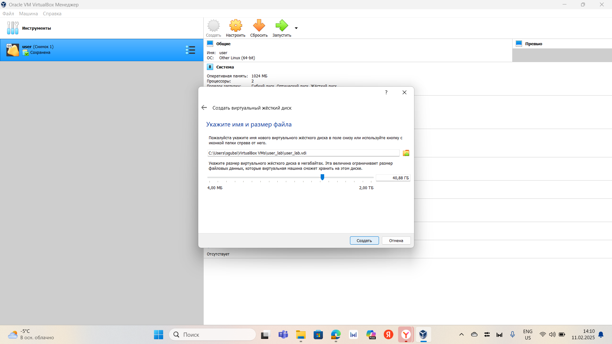
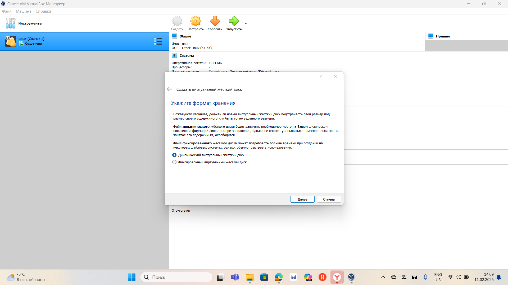
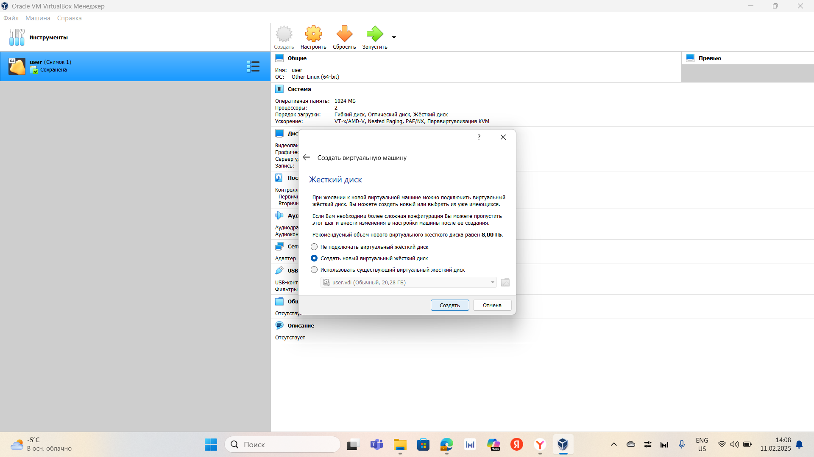
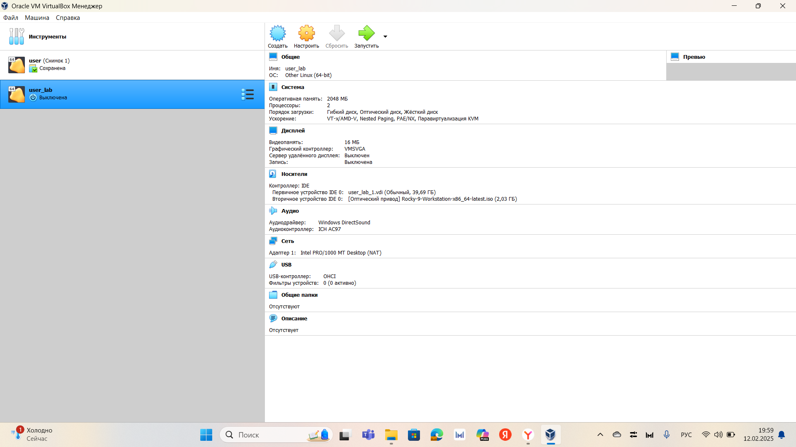
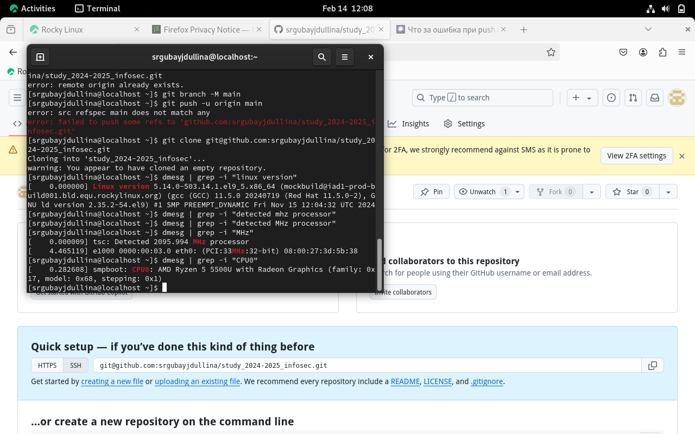
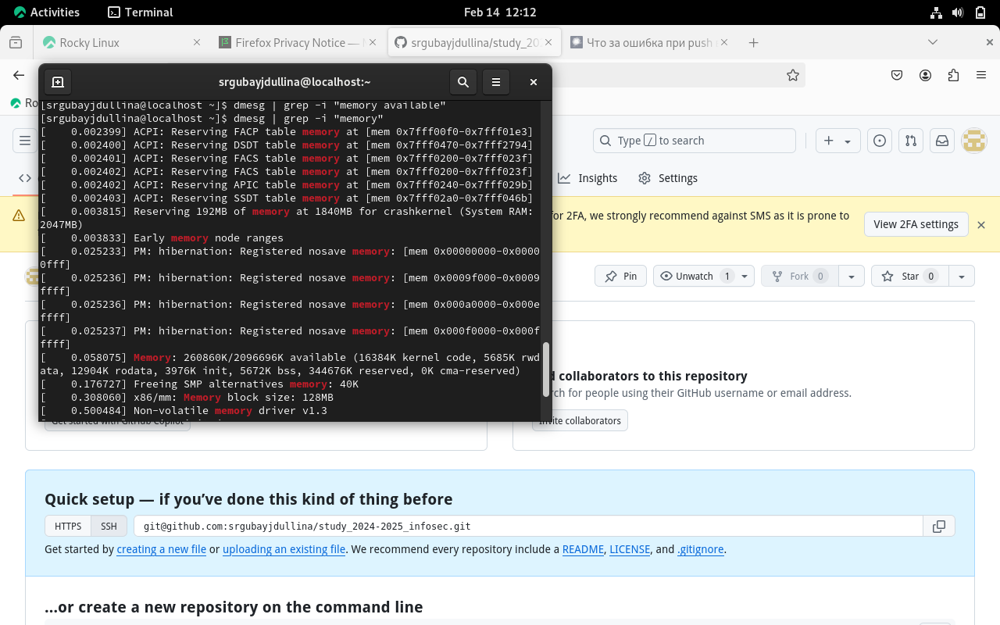
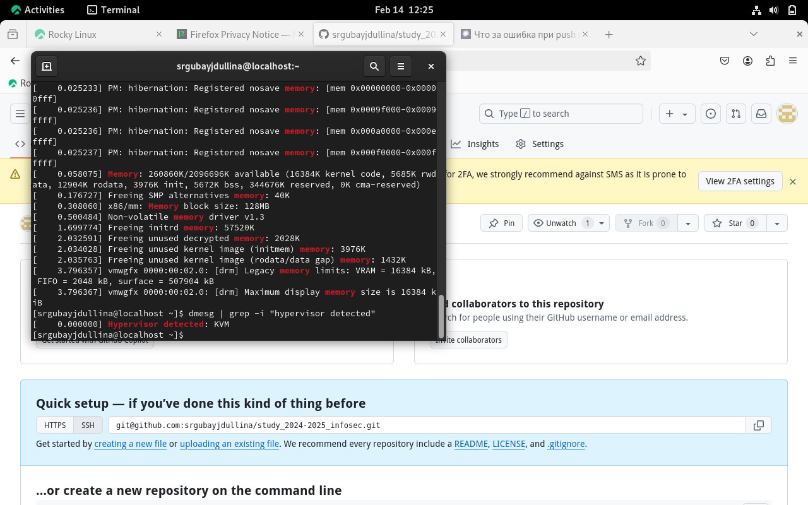
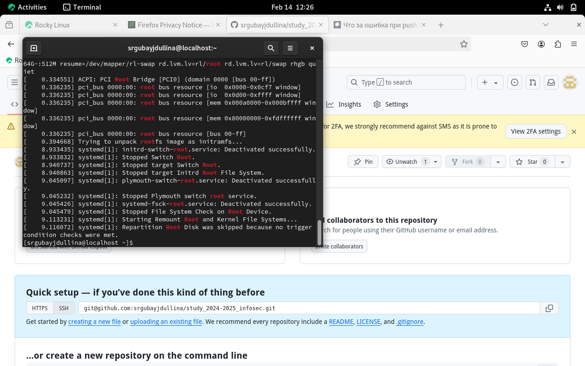
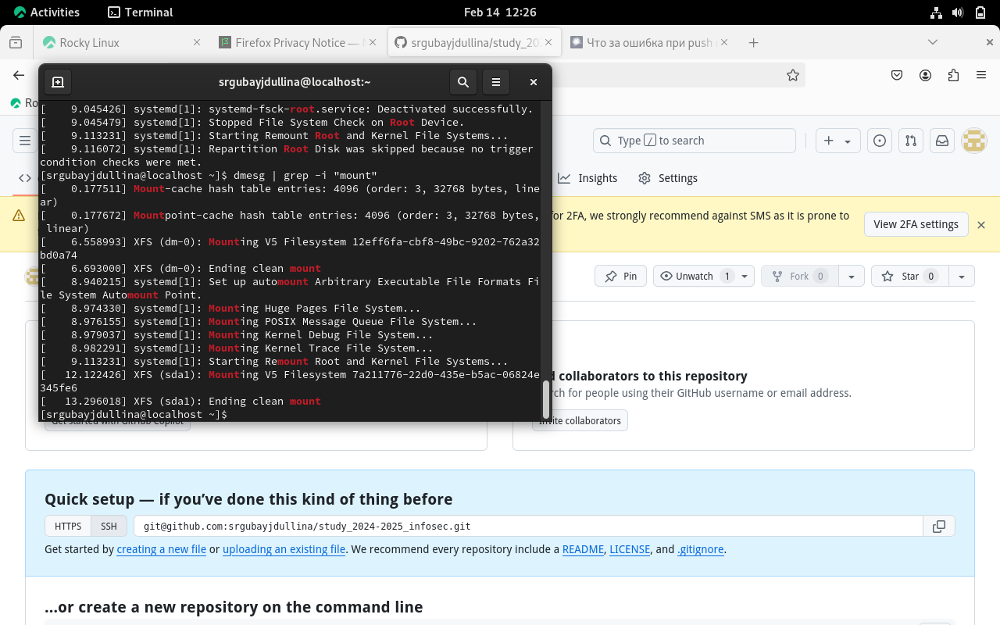

---
## Front matter
title: "Лабораторная работа №1"
subtitle: "Установка и конфигурация операционной системы на виртуальную машину"
author: "Люпп Софья Романовна"

## Generic otions
lang: ru-RU
toc-title: "Содержание"

## Bibliography
bibliography: bib/cite.bib
csl: pandoc/csl/gost-r-7-0-5-2008-numeric.csl

## Pdf output format
toc: true # Table of contents
toc-depth: 2
lof: true # List of figures
lot: true # List of tables
fontsize: 12pt
linestretch: 1.5
papersize: a4
documentclass: scrreprt
## I18n polyglossia
polyglossia-lang:
  name: russian
  options:
	- spelling=modern
	- babelshorthands=true
polyglossia-otherlangs:
  name: english
## I18n babel
babel-lang: russian
babel-otherlangs: english
## Fonts
mainfont: IBM Plex Serif
romanfont: IBM Plex Serif
sansfont: IBM Plex Sans
monofont: IBM Plex Mono
mathfont: STIX Two Math
mainfontoptions: Ligatures=Common,Ligatures=TeX,Scale=0.94
romanfontoptions: Ligatures=Common,Ligatures=TeX,Scale=0.94
sansfontoptions: Ligatures=Common,Ligatures=TeX,Scale=MatchLowercase,Scale=0.94
monofontoptions: Scale=MatchLowercase,Scale=0.94,FakeStretch=0.9
mathfontoptions:
## Biblatex
biblatex: true
biblio-style: "gost-numeric"
biblatexoptions:
  - parentracker=true
  - backend=biber
  - hyperref=auto
  - language=auto
  - autolang=other*
  - citestyle=gost-numeric
## Pandoc-crossref LaTeX customization
figureTitle: "Рис."
tableTitle: "Таблица"
listingTitle: "Листинг"
lofTitle: "Список иллюстраций"
lotTitle: "Список таблиц"
lolTitle: "Листинги"
## Misc options
indent: true
header-includes:
  - \usepackage{indentfirst}
  - \usepackage{float} # keep figures where there are in the text
  - \floatplacement{figure}{H} # keep figures where there are in the text
---

# Цель работы

Приобретение практических навыков установки операционной системы на виртуальную машину, настройка минимально необходимых сервисов.

# Задание

1) Установить образ dvd-iso Rocky и виртуальную машину VirtualBox;

2) Настроить параметры виртуальной машины;

3) Установить VM на жесткий диск;

4) Выполнение домашней работы.

# Выполнение лабораторной работы

Так как виртуальная машина уже была установлена на моей технике, остается только установить dvd-iso образ rocky. В VirtualBox начинаю установку параметров будущей виртуальной машины. Первый параметр - размер жесткого диска, выделяю чуть больше 40 гб (рис. [-@fig:001]):

{#fig:001 width=70%}

Выбираю динамический формат хранения (рис. [-@fig:002]):

{#fig:002 width=70%}

Создаю абсолютно новый виртуальный диск (рис. [-@fig:003]):

{#fig:003 width=70%}

{#fig:004 width=70%}

Далее остается лишь запустить виртуальную машину, а затем установить VM на жесткий диск - installation. Выбираем параметры - английский язык; создаем нового пользователя (логин и пароль), а также выбираем диск, на который будем устанавливать машину. Завершаем установку, перезагружаем виртуальную машину (reboot).

 Далее остается только настроить git и сделать домашнюю работу.

Можно использовать поиск с помощью grep:
dmesg | grep -i "то, что ищем"

Получаем следующую информацию: версия ядра Linux (Linux version), частота процессора (Detected Mhz processor), модель процессора (CPU0), объем доступной оперативной памяти (Memory available), тип обнаруженного гипервизора (Hypervisor detected), тип файловой системы корневого раздела (рис. [-@fig:004]), (рис. [-@fig:005]), (рис. [-@fig:006]), (рис. [-@fig:007]), (рис. [-@fig:008]), (рис. [-@fig:009])::

{#fig:004 width=70%}

{#fig:005 width=70%}

{#fig:006 width=70%}

{#fig:007 width=70%}

{#fig:008 width=70%}

{#fig:009 width=70%}

Ответы на контрольные вопросы:

1) Имя пользователя, пароль, в некоторых случаях почту, язык страны.

2) Команда man для получения справки по команде, cd для перемещения по каталогам, ls для просмотра содержимого в каталоге, du для определения обьема каталога, mkdir для создания каталога, rmdir - для его удаления, touch - создание файла, а rm - соотвественно, удаления файла, chmod для задания определенных прав пользователя, history - для просмотра истории вводимых команд.

3) Файловая система - способ организации и хранения данных на носителе информации, который позволяет пользователям и операционной системе эффективно управлять файлами и каталогами. Примеры: FAT32, NTFS, ext4, XFS и прочие.

4) Существуют специальные команды для просмотра подмонтированных файлов в ОС, таких, как df, mount.

5) Удалить зависший процесс можно при помощи команд: KILL PID, KILL -9 PID, top.

# Выводы

Выполняя данную лабораторную работу, я приобрела практические навыки установки операционной системы на виртуальную машину и навыки настройки минимально необходимых сервисов.

# Список литературы{.unnumbered}

::: {#refs}
:::
